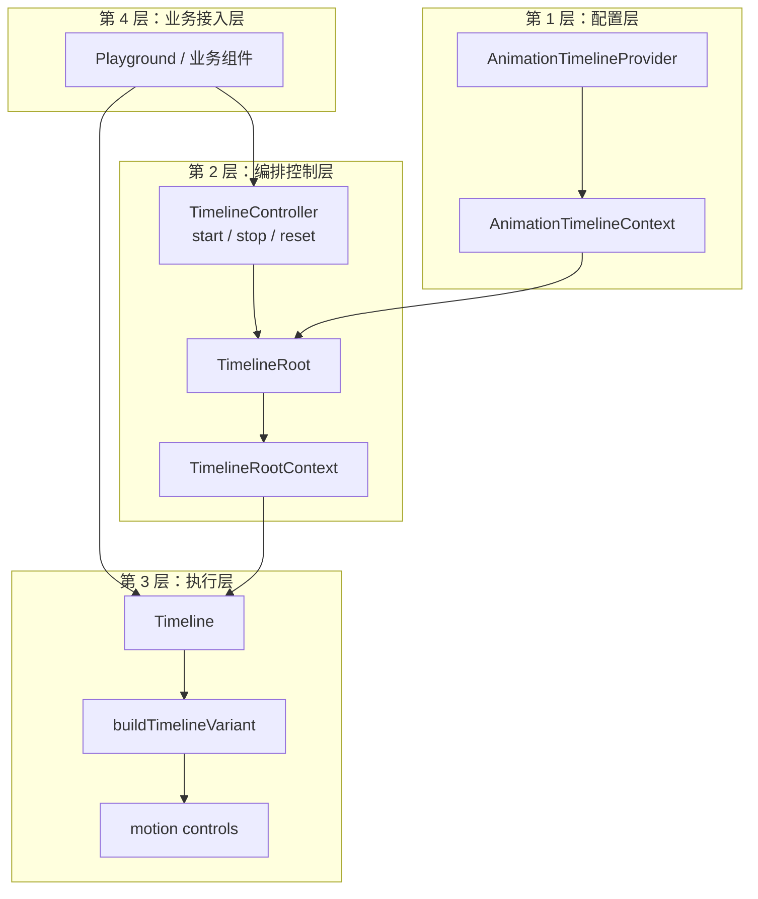
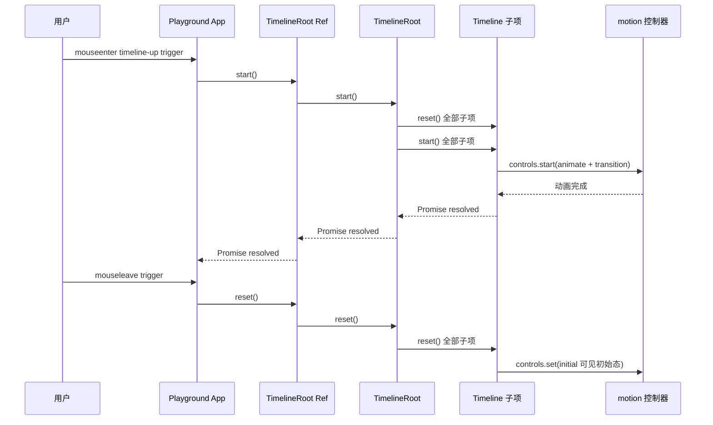
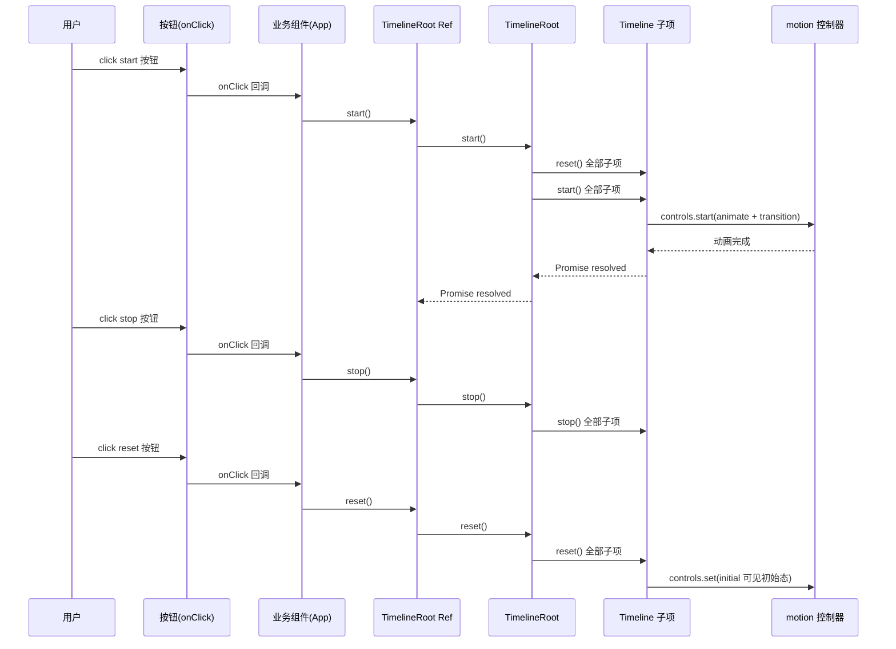

# Timeline Kit 架构说明

## 组件架构图

```mermaid
flowchart TD
  A[AnimationTimelineProvider<br/>props: value?: Partial<TimelineDefaults>, children] --> B[AnimationTimelineContext<br/>全局默认动画配置]

  C[TimelineRoot<br/>props: value?, autoPlay?, className?, children<br/>ref: TimelineController(start/stop/reset)] --> D[TimelineRootContext<br/>defaults, autoPlay, nextIndex, registerItem]

  B --> C
  D --> E[Timeline 子项 #1]
  D --> F[Timeline 子项 #2]
  D --> G[Timeline 子项 #N]

  E --> H[buildTimelineVariant<br/>合并 defaults + item props + index]
  F --> H
  G --> H

  H --> I[motion 控制器<br/>start/stop/reset]
  I --> J[渲染 motion 组件]

  C -.registerItem.-> I
  K[父组件 / Playground] -- ref 调用 --> C
```

## 关键 Props 与 Ref

- `AnimationTimelineProvider`
  - **Props**: `value?: Partial<TimelineDefaults>`、`children`
  - **作用**: 提供全局 timeline 默认配置。

- `TimelineRoot`
  - **Props**: `value?: Partial<TimelineDefaults>`、`autoPlay?: boolean`、`className?: string`、`children`
  - **Ref**: `TimelineController`
    - `start(): Promise<void>`
    - `stop(): void`
    - `reset(): void`
  - **作用**: 统一管理子项顺序、注册子项控制器、编排播放状态。

- `Timeline`
  - **Props**: `at`、`index`、`direction`、`distance`、`duration`、`ease`、`as`、`className`、`children`、`...rest`
  - **作用**: 构建动画变体并绑定 motion 控制器。

## API 分层图



## 时序图（Hover 交互）



## 时序图（按钮点击函数触发）


